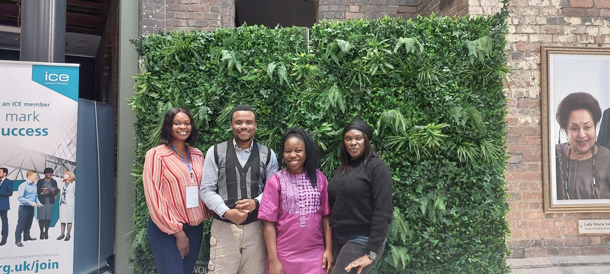

# SAS-Curiosity-Cup2024 - Navigating Towards Vision Zero: A Precision Approach to Mitigating Traffic Accidents in the Netherlands by 2050

**Team SASInsight Trailblazers**
**Team Members: Oluwatimilehin E. Olabamiyo, Michael U. Egbuzobi, Nonye F. Nweke, and Cynthia O. Onyia
Affiliation: University of Wolverhampton**

#  Project Overview
This project, part of the SAS Curiosity Cup 2024, delves into the dynamics of traffic accidents in the Netherlands with the goal of supporting the Vision Zero initiative—a national ambition to eliminate all road fatalities and serious injuries by 2050. Using SAS Viya®, we explored accident trends, identified risk factors, and proposed strategic interventions to enhance road safety. Meet the team behind this initiative:

**Team SASInsight Trailblazers**

**Problem Statement**

Despite the Netherlands’ reputation for robust cycling infrastructure and advanced traffic management, traffic accidents persist as a significant challenge, particularly among vulnerable road users like cyclists, pedestrians, and motorcyclists. Leveraging the SAS Visual Analytics platform, this study investigated patterns in accident data to uncover critical insights and offer data-driven recommendations for targeted safety measures.

**Data Details**

-  Source: Department of Traffic System (Dataset: "ONGEVALLEN2016_EN")
-  Volume: 124,992 observations of traffic accidents in 2016
-  Features: Variables such as accident type, age of casualties, environmental conditions, and geographic location

**Data Preparation:**

-  Cleaned missing data to ensure analytical accuracy.
-  Transformed numerical data (e.g., casualty age) into categorical variables.
-  Enhanced spatial analysis by standardizing province names and extracting province-level data.
-  Introduced temporal dimensions by adding month, weekday, and hour variables.

**Key Insights**

**i.   Urban vs. Rural Disparities**

  -  Urban Areas: Higher accident frequencies but fewer fatalities due to better emergency response.
  
  -  Rural Areas: Fewer accidents overall but more severe outcomes due to higher speeds and limited infrastructure.
 
  
**ii. Vulnerable Groups**

  -  Cyclists and motorcyclists dominate accident statistics, particularly in provinces with dense cycling networks like Zuid Holland, Noord-Holland, and Noord Brabant.

  

**iii. Temporal Patterns**

  -  Peak accident times: Evening rush hours (17:00–18:00).
  
  -  High-risk days: Weekends, especially Saturdays, linked to DUI and risky driving behaviors.

     
  
**iv. Accident Severity**

  -   One-sided collisions involving bikes/motorcycles account for significant hospitalizations.

  -   Pedestrian accidents, while fewer, lead to substantial hospital injuries, highlighting their vulnerability.

   

**Recommendations**

**i.  Policy and Enforcement**

-  Enhance DUI enforcement on weekends and launch public awareness campaigns targeting young drivers.

  **ii.  Infrastructure Improvements**

-  Expand segregated cycling paths and pedestrian zones in urban areas.

-  Upgrade rural roads with better lighting, signage, and emergency response capabilities.
  
**iii.  Smart Traffic Solutions**

-  Implement intelligent traffic management systems to address congestion and minimize accident risks during peak hours.
  
**iv.  Data-Driven Decision Making**

-  Regularly analyze traffic data to identify emerging trends and adapt policies dynamically.
  

**Limitations and Future Work**

-  The dataset is limited to a single year (2016), restricting the analysis of long-term trends.

-  Missing values and lack of detailed contextual data (e.g., driver behavior) limit the depth of insights.

-  Future studies should incorporate historical data and explore multifactorial causes of accidents using advanced analytics.

 **Acknowledgments**
 
Special thanks to Dr. Liam Naughton and Mr. Julius Odede for their invaluable guidance throughout this project.

**References**

Key references include works by Wegman (2017), Schepers et al. (2014), and Kaplan (2019), among others. For a comprehensive list of references, please see the attached project documentation.

